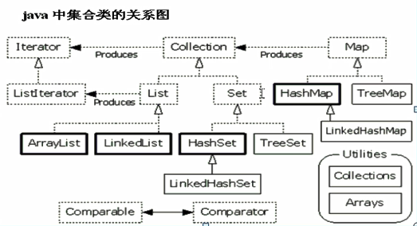

###  集合和数组的区别

- 数组的长度是固定的；集合的长度是可变的。
- 数组中存储的是同一类型的元素，也可以存储基本数据类型；集合存储的都是对象，而且类型可以不一致。

### java集合框架关系图

### 集合框架的基础

- java中集合的顶层接口collection
- 集合中存储的都是对象的引用
- 从集合中取出对象要使用对象的方法必须向下转型

### List

- list的特点：有序(指存入和取出的顺序一致)，带索引可以通过索引对集合中的元素精确控制，元素是可以重复的。

- 常用子类

  >ArrayList :  数组结构，由长度可变的数组实现，查询速度快，增删速度慢。
  >
  >LinkedList : 是链表结构，不同步，增删的速度快，查询的速度慢。
  >
  >Vector : 可增长的数组结构(与ArrayList一样，Vector是同步的)

### Set

- set的特点：不包含重复元素的collection，方法与collection一致，不保证顺序

- 常用子类

  > HashSet :  哈希表结构，不同步，保证元素唯一性方法依赖于：hashCode(),equals()方法；
  >
  > ​		LinkedHashSet:相对于HashSet可以保证元素有序
  >
  > TreeSet :  二叉树结构 可以对set集合中的元素进行排序，判断对象compareTo()是否为0;	

- 元素的排序有两种方式
  - 元素自身具备自然排序：实现Comparable接口，重写compareTo();
  - 比较器：实现Comparator接口，重写compare();(元素自身不具备自然排序)

### Map

- Map的特点：内部存储都是键值对；需要保证键的唯一性；如果键相同，值会覆盖。

-  常用字类

  >Hashtable:哈希表结构，是同步的，不允许null作为键和值，被HashMap替代
  >
  >> ​	Properties:键和值都是字符串
  >
  >HashMap:哈希表结构，不同步，允许值或者键为null
  >
  >> LinkedHashMap:基于链表+哈希表，可以保证Map集合有序(存入和取出的顺序一致)
  >
  >Tree Map:二叉树结构，不同步，可以对集合中的键进行排序