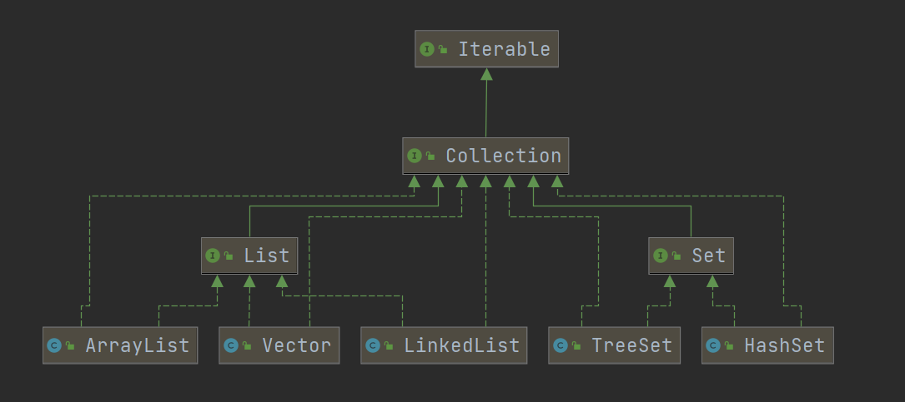
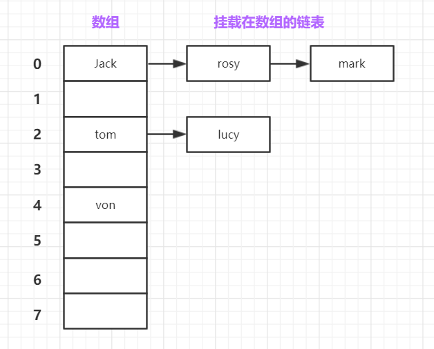
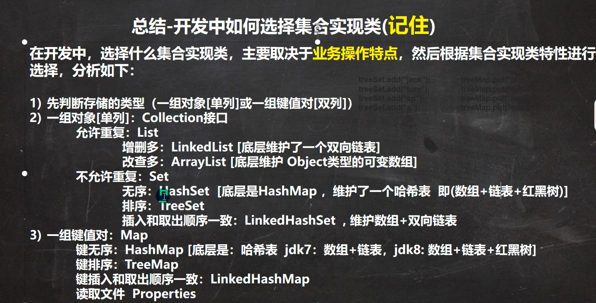

## 一、Java中的集合介绍
### 1.1 Java中的集合体系
在Java中整体的将集合分为单列和双列两个大体系；单列体系是指用户只需要提供一个值，集合就可以存储，在Java中所有单列集合都继承于Collection；主要分为List集合，和Set集合。双列体系是指用户需要提供一对键值对（K-V）集合才可以存储，在Java中所有的双列集合都继承于Map。
##### Collection集合体系 （常用类）

##### Map集合体系 （常用类）

## 二、Collection集合体系
### 2.1 Collection接口实现类的特点

1. 每个Collection接口的实现子类可以存储多个元素，元素的类型可以是任意类型
1. Collection接口没有直接的实现子类，可实现子类都是实现于它的子接口List | Set
1. 有些Collection接口的实现类可以存放相同的元素，有些不可以
1. 有些Collection接口的实现类是有序的，有些不是有序的 （这里的有序是指存储时和取出的顺序相同）
### 2.2 Collection接口常用方法
```java
// 添加一个元素
boolean add(E e)
// 将集合添加到该集合
boolean addAll(Collection<? extends E> c);
// 移除一个元素
boolean remove(Object o);
// 从集合中移除c集合包含的元素
boolean removeAll(Collection<?> c);
// 集合中是否包含元素
boolean contains(Object o);
// 清空集合
void clear();
```
### 2.3 Collection集合遍历元素方法
#### 2.3.1 使用迭代器 （Iterator）
Collection集合继承了Iterable接口其所有实现子类都需要重写Iterable接口中的Iterator<E> Iterator()方法，该方法返回一个Iterator对象，使用Iterator对象可以完成对Collection中元素的遍历
##### 迭代器的使用
迭代器的使用非常简单，当我们调用集合的Iterator()方法获取一个Iterator接口对象后，可以调用其方法完成对集合的遍历，方法如下：
```java
// 迭代器中的方法
// 判断集合中是否还有下一个元素
boolean hasNext();
// 返回当前游标指向的元素
E next();
// 移除当前游标指向的元素
void remove()
```
> 注意：在每次指向next()方法之前，都需要执行hasNext()方法。

#### 2.3.2 使用增强for循环
如果指对集合|数组做间的的遍历，可以使用增强for循环。增强for循环的底层实际也是使用了迭代器
> 注意：增强for循环只能遍历集合|数组，不能修改或者删除原始

### 2.4 List接口
#### 2.4.1 List接口特点

1. List接口中都元素都是有序的，且可以重复
1. List接口中的每个元素都有对应的索引，可以通过索引操作元素
1. List接口常用实现了包括ArrayList,LinkedList,Vector
#### 2.4.2 ArrayList

1. ArrayList基本介绍
   - ArrayList底层是通过数组实现的
   - ArrayList可以添加多个 null为元素
   - ArrayList基本上等同于Vector，但是ArrayList是不是线程安全的，Vector是线程安全的
2. ArrayList底层机制和源码解析
   - ArrayList底层是通过维护一个Object[]数组实现的 `transient Object[] elementData` （被transient修饰的变量在序列化时不会被序列化）
   - ArrayList扩容问题
      - 如果在实例化ArrayList对象时使用的是无参构造器，那么在第一次添加元素时，会默认初始化长度为10。当再次需要扩容时会增加为原来长度的1.5倍
      - 如果在实例化ArrayList对象时使用的是指定大小构造器，会默认初始长度为指定值。当再次需要扩容时会增加为原来长度的1.5倍
```java
// ArrayList扩容代码 jdk11

// minCapacity的值是当前elementData数组length+1,表示的是当前数组需要容量的最小值
private int newCapacity(int minCapacity) {
    // 对elementData数组进行扩容
    int oldCapacity = elementData.length;
    // 扩容为原来长度1.5倍
    int newCapacity = oldCapacity + (oldCapacity >> 1);
    // 判断扩容后的长度是否达到了当前数组所需要的容量最小值
    // 注意:在使用无参构造器初始化时，默认elementData数组长度为0,所以在第一次扩容是oldCapacity会为0,故newCapacity也为0，执行下列if语句。
    if (newCapacity - minCapacity <= 0) {
        // 判断当前数组是否为无参构造器初始的
        if (elementData == DEFAULTCAPACITY_EMPTY_ELEMENTDATA)
            // DEFAULT_CAPACITY的值为10，这也就是使用无参构造器初始化时，数组长度默认为10的原因
            return Math.max(DEFAULT_CAPACITY, minCapacity);
        if (minCapacity < 0) // overflow
            throw new OutOfMemoryError();
        return minCapacity;
    }
    return (newCapacity - MAX_ARRAY_SIZE <= 0)
        ? newCapacity
        : hugeCapacity(minCapacity);
}
```
#### 2.4.3 Vector

1. Vector基本介绍
   - Vector底层也是维护了一个Object类型的数组
   - Vector是线程同步（线程安全）的，在开发中，如果有线程安全时可以使用Vector
2. Vector的扩容机制
   - 如果在实例化Vector对象时使用的是无参构造器，那么在第一次添加元素时，会默认初始化长度为10。当再次需要扩容时会增加为原来长度的2倍
   - 如果在实例化Vector对象时使用的是指定大小构造器，会默认初始长度为指定值。当再次需要扩容时会增加为原来长度的2倍
#### 2.4.4 LinkedList

1. LinkedList 基础介绍
   - LinkedList 底层实现了双向链表和双端队列
   - LinkedList 可以添加任意类型的元素包括null，且可以重复
   - LinkedList 不是线程安全的
2. LinkedList 底层操作机制
   - LinkedList 底层维护了一个双向链表，由first指向链表头部，last指向链表尾部
   - LinkedList 中的每个节点（Node类）维护了prev,next,item三个属性
   - LinkedList 在对元素的添加和删除，效率较高 
### 2.5 Set接口
#### 2.5.1 Set接口的特点

- Set接口是无序的，没有索引
- Set不能不能有重复的元素，最多包含一个null
#### 2.5.2 HashSet

1. HashSet 基础介绍 
   - HashSet实现了Set接口
   - HashSet的底层实际是维护了一个HashMap 
   - HashSet不能包装元素的有序，元素的顺序是由hash后元素的位置决定的

因为HashSet的底层使用的是HashMap，下面会对HashMap的原理解析
#### 2.5.3 LinkedHashSet

1. LinkedHashSet 基础介绍
   - LinkedHashSet是HashSet的一个子类
   - LinkedHashSet底层是一个LinkedHashMap（底层维护的是一个数组+双向链表）
   - LinkedHashSet 是根据元素的hashcode()来决定元素的存储位置，同时使用链表来维护元素的次序（用一个链表来描述元素添加的顺序），所以元素有序的
   - LinkedHashSet 不允许存储相同的元素
## 三、Map
### 3.1 Map接口实现类的特点

- Map用来保存具有映射关系的数据（kev-value）
- Map中的key不允许重复
- Map中的key和value都可以是null，key的null唯一
### 3.2 HashMap数据结构
HashMap底层采用的数据结构是：数组(table)+链表+红黑树。这里的红黑树，是当满足一定条件后将挂载在数组上的链表转为红黑树，用来提高遍历效率。
如下图：


### 3.3 HashMap底层原理 （Java中的实现方式）
#### 3.3.1 关于Java中的hashcode()方法和equals()方法 // todo
在Java中的顶级父类Object中定义了hashcode()方法和equals()方法，所以Java中的所有类都可以重写这两个方法。
#### 3.3.2 HashMap的大致执行过程

1. 当添加一个元素时，会调用起hashcode()方法再通过计算得到一个hash值，该hash值就是该元素在table中的索引
1. 添加该元素
   1. 如果table[hash]不存在其他元素结点，直接将该元素存储在table[hash]位置
   1. 如果table[hash]已经存在其他元素结点，就要用该元素和当前table[hash]链表上所有的结点比较，首先会判断是否是同一个对象（==），其次再调用equals()方法判断是否属于相同元素，如果相同替换元素；如果比较到链表尾部都不相同，则添加该元素到链表尾部。
3. 如果当前有某个链表上的元素个数大于等于默认（TREEIFY_THRESHOLD = 8）并且 table的大小大于等于（MIN_TREEIFY_CAPACTIY = 64）那么该链表就会被树化
#### 3.3.3 HashMap Table的扩容机制

1. 当第一次向HashMap中添加元素时，会初始化table的长度为DEFAULT_INITIAL_CAPACITY(16)。
1. 每次扩容都会设置table下次扩容阈值threshold为（DEFAULT_LOAD_FACTOR * table.length）其中DEFAULT_LOAD_FACTOR 加载因子默认值（0.75f），当table中添加的元素个数大于阈值时就会为table扩容table.length << 1(原来长度的2倍)
1. 当table的长度达到MIN_TREEIFY_CAPACITY（64）后，table将不会倍扩容，而是通过将链表树化来提高效率
> 注意：扩容的条件是map中的元素大于阈值，而不是table
> 能够触发HashMap扩容的两个条件：
> - 当table某索引的长度达到8，但是table的长度没有到达最大64会扩容
> - 当HashMap中的元素个数超过达阈值会扩容

#### 3.3.4 HashMap 添加操作代码分析
可以从下列的代码中验证上述所说的HashMap原理
```java
// 公共的添加方法，实际操作时调用了方法putVal()
public V put(K key, V value) {
	return putVal(hash(key), key, value, false, true);
}

// putVal()方法，真正的添加元素方法
final V putVal(int hash, K key, V value, boolean onlyIfAbsent,boolean evict) {
    // 定义一些临时变量
	Node<K,V>[] tab; Node<K,V> p; int n, i;
    /* 
    	- table就是HashMap中的数组
    	- 这里的意思时，判断当前table为空时，会对其进行初始化（扩容）
        - tab指向table;n为table的长度
    */
	if ((tab = table) == null || (n = tab.length) == 0)
	    n = (tab = resize()).length;
    /*
    	- 通过(n - 1) & hash的计算结果i 来确定当前元素，应该再table的哪个索引位置
    	- 如果当前索引上没有任何结点时，直接将当前元素添加到该索引
    */
	if ((p = tab[i = (n - 1) & hash]) == null)
	    tab[i] = newNode(hash, key, value, null);
	else {
       	/*
        	- 当前代码块的功能：表不为空，且要插入当前节点的索引位置已经有节点的处理    
        */
	    Node<K,V> e; K k;
        // 经过上一个if的执行，当前p指向的时，要插入索引上链表的首节点，判断要添加的元素是否和p相同
	    if (p.hash == hash &&
	        ((k = p.key) == key || (key != null && key.equals(k))))
	        e = p;
        // 判断当前索引上的链表是否已经树化
	    else if (p instanceof TreeNode)
            // 将带插入的元素，插入到红黑树上
	        e = ((TreeNode<K,V>)p).putTreeVal(this, tab, hash, key, value);
	    else {
            // 当前链表没有被树化的操作，会依次遍历当前链表和待插入元素进行比较是否相同
	        for (int binCount = 0; ; ++binCount) {
                // 遍历到链表尾部，没有相同元素，进行插入
	            if ((e = p.next) == null) {
                    // 将待插入节点插入到链表尾
	                p.next = newNode(hash, key, value, null);
                    // 判断当前链表的结点个数是否大于等于链表长度的阈值
	                if (binCount >= TREEIFY_THRESHOLD - 1) // -1 for 1st
                        // 在该方法里，会先判断当前table当长度是否达到默认MIN_TREEIFY_CAPACITY，如果没有会将table扩容；如果达到则会树化当前链表
	                    treeifyBin(tab, hash);
	                break;
	            }
                // 如果有相同的元素，将不会添加
	            if (e.hash == hash &&
	                ((k = e.key) == key || (key != null && key.equals(k))))
	                break;
	            p = e;
	        }
	    }
        // map中已经存在待添加的元素，替换元素
	    if (e != null) { // existing mapping for key
	        V oldValue = e.value;
	        if (!onlyIfAbsent || oldValue == null)
	            e.value = value;
	        afterNodeAccess(e);
	        return oldValue;
	    }
	}
	++modCount;
    // 添加完元素后,判断元素个数是否到达阈值，是否需要扩容
	if (++size > threshold)
	    resize();
	afterNodeInsertion(evict);
	return null;
}
```
扩容操作
```java
final Node<K,V>[] resize() {
	Node<K,V>[] oldTab = table;
	// 当前table长度
	int oldCap = (oldTab == null) ? 0 : oldTab.length;
    // 当前table需要扩容的阈值
	int oldThr = threshold;
	int newCap, newThr = 0;
    // hashmap非第一次添加元素走当前条件语句
	if (oldCap > 0) {
        // 判断
	    if (oldCap >= MAXIMUM_CAPACITY) {
	        threshold = Integer.MAX_VALUE;
	        return oldTab;
	    }
	    else if ((newCap = oldCap << 1) < MAXIMUM_CAPACITY &&
	             oldCap >= DEFAULT_INITIAL_CAPACITY)
	        newThr = oldThr << 1; // double threshold
	}
	else if (oldThr > 0) // initial capacity was placed in threshold
	    newCap = oldThr;
	else {               // zero initial threshold signifies using defaults
        // 第一次添加元素 DEFAULT_INITIAL_CAPACITY=16；DEFAULT_LOAD_FACTOR=0.75f
	    newCap = DEFAULT_INITIAL_CAPACITY;
	    newThr = (int)(DEFAULT_LOAD_FACTOR * DEFAULT_INITIAL_CAPACITY);
	}
	if (newThr == 0) {
	    float ft = (float)newCap * loadFactor;
	    newThr = (newCap < MAXIMUM_CAPACITY && ft < (float)MAXIMUM_CAPACITY ?
	              (int)ft : Integer.MAX_VALUE);
	}
	threshold = newThr;
	@SuppressWarnings({"rawtypes","unchecked"})
    // 扩容操作
	Node<K,V>[] newTab = (Node<K,V>[])new Node[newCap];
	table = newTab;
	if (oldTab != null) {
	    for (int j = 0; j < oldCap; ++j) {
	        Node<K,V> e;
	        if ((e = oldTab[j]) != null) {
	            oldTab[j] = null;
	            if (e.next == null)
	                newTab[e.hash & (newCap - 1)] = e;
	            else if (e instanceof TreeNode)
	                ((TreeNode<K,V>)e).split(this, newTab, j, oldCap);
	            else { // preserve order
	                Node<K,V> loHead = null, loTail = null;
	                Node<K,V> hiHead = null, hiTail = null;
	                Node<K,V> next;
	                do {
	                    next = e.next;
	                    if ((e.hash & oldCap) == 0) {
	                        if (loTail == null)
	                            loHead = e;
	                        else
	                            loTail.next = e;
	                        loTail = e;
	                    }
	                    else {
	                        if (hiTail == null)
	                            hiHead = e;
	                        else
	                            hiTail.next = e;
	                        hiTail = e;
	                    }
	                } while ((e = next) != null);
	                if (loTail != null) {
	                    loTail.next = null;
	                    newTab[j] = loHead;
	                }
	                if (hiTail != null) {
	                    hiTail.next = null;
	                    newTab[j + oldCap] = hiHead;
	                }
	            }
	        }
	    }
	}
	return newTab;
}	
```
### 3.4 Map的遍历
#### 3.4.1 Map特有遍历方式
在Map中是通过key-value的映射方式存储数据的，这些k-v存储在HashMap$Node结点类中。对于这种k-v形式的特殊数据，jdk提供了独有的机制方便遍历。在Map接口中提供了Entry接口，用于封装k-v，可以通过getKey()，getValue()方法获取。
在Map的常用子类中，提供了EntrySet类用来封装了当前Map中所有的键值对，可以通过entrySet方法返回一个Set集合Set<Map.Entry<K,V>>,包含了EntrySet类封装的当前所有Map集合的k-v(封装成Entry)。
其实封装在Entry中的数据，就是指向HashMap$Node中对于的值，HashMap$Node实现了Map.Entry,可以向上转型。
### 3.5 Hashtable
#### 3.5.1 Hashtable的特点

- Hashtable和HashMap的用法是一致的
- Hashtable的键和值都不能为null （如果为null，会抛出NullPointerException移除）
- Hashtable是线程安全的
#### 3.5.2 Hashtable的底层

- Hashtable中的k-v是存储在Hashtable$Entry中
- Hashtable中的数组初始长度为11
- Hashtable扩容
   - 当Hashtable中的元素超过阈值（threshold = table.length * 0.75f）会进行扩容
   - 扩容大小为 newCapacity = （OldCapacity << 1） + 1
### 3.6 TreeMap
TreeSet同下，因为TreeSet的底层是维护了一个TreeMap
#### 3.6.1 TreeMap的特点

- TreeMap 的key唯一，且key的值不能为null
- TreeMap 会对添加的元素进行排序
   - Comparable 排序方式
      - 默认的排序方式，要求添加到key的对象实现Comparable 接口并实现compareTo方法
   - Comparator 排序方式
      - 需要独立给TreeMap传递一个key排序的方案，需要实现Comparator 接口实现compare方法
## 三、集合选择



